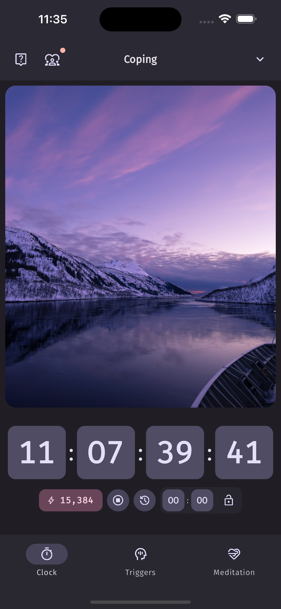
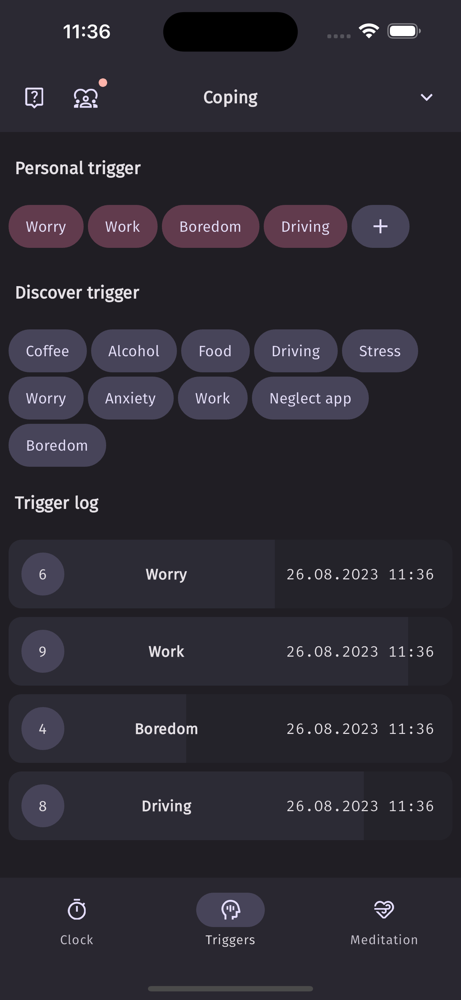
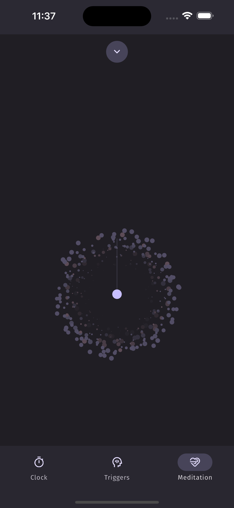
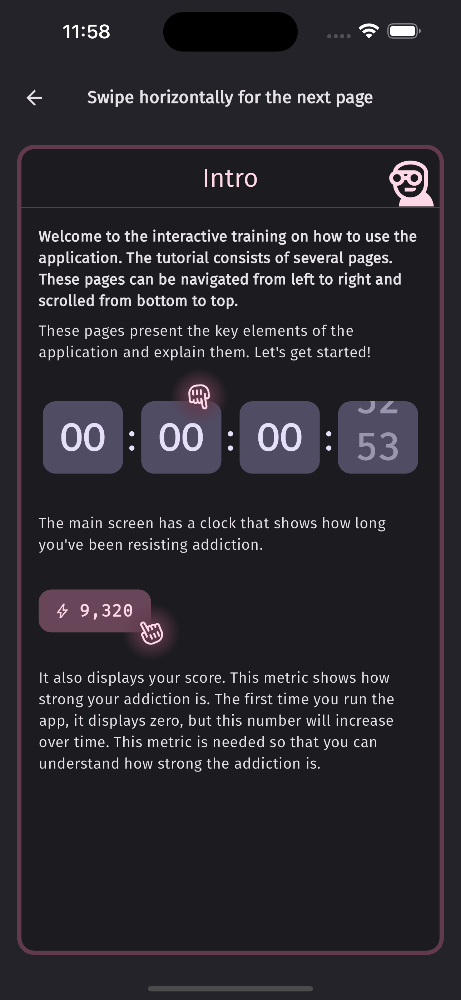
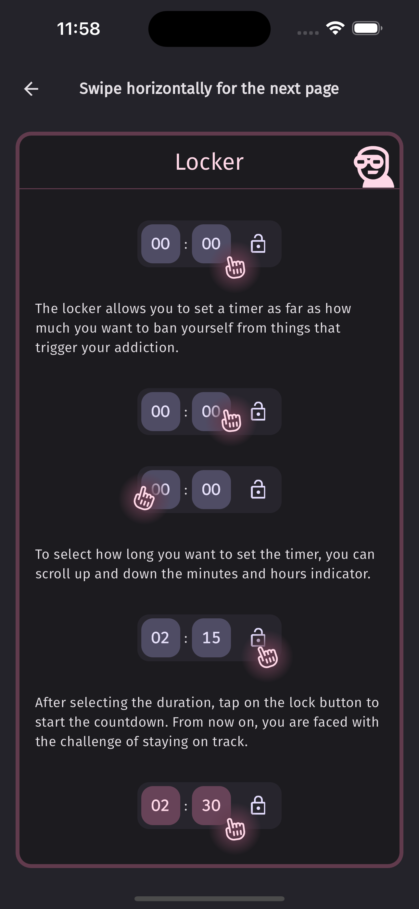
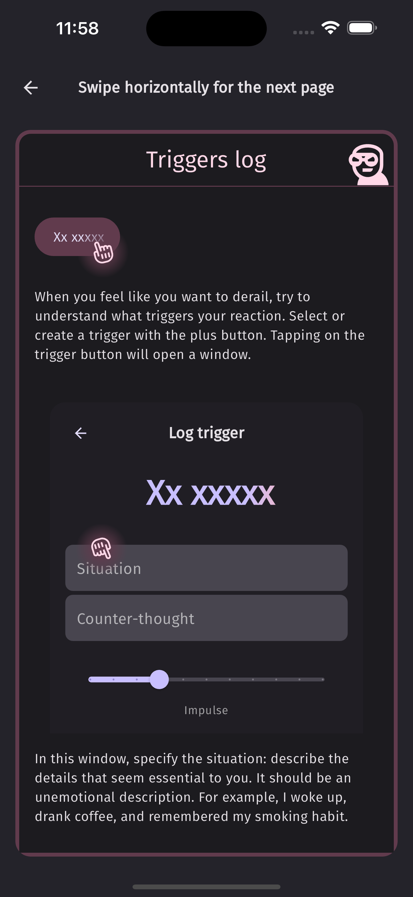
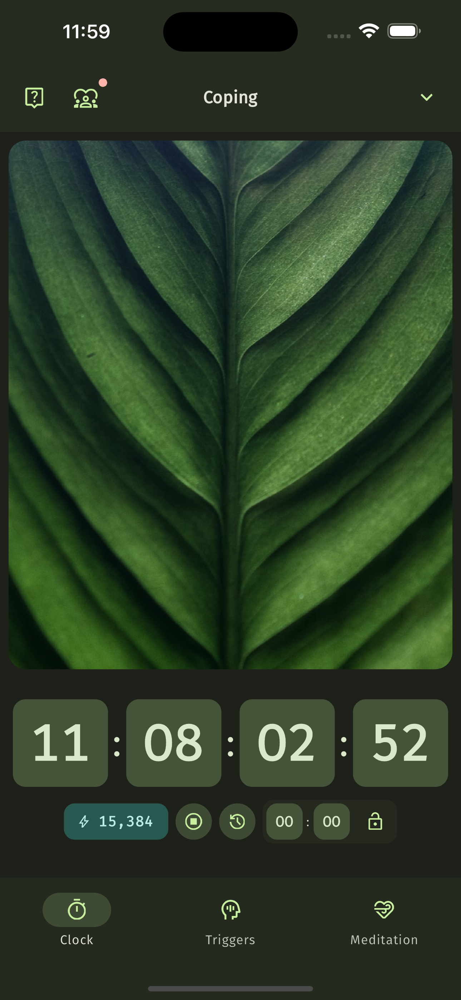
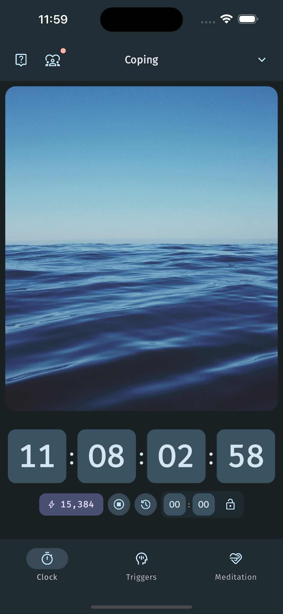

# Coping

I'm thrilled to announce that I'm open-sourcing the Coping App for iOS, a comprehensive and user-friendly application designed to help individuals quit addictions and lead healthier lives. This has been a labour of love, and I'm excited to share it with the world. It's also my first project on flutter that has been launched.

_Meet Coping mascot! I'm proud that made him myself. It was really hard to make it a project as a solo dev, but it's great to learn new ways to manage your work._


## Coping App for iOS

|||||||||
|-|-|-|-|-|-|-|-|


https://apps.apple.com/rs/app/coping/id6450903073

Coping App is a comprehensive and user-friendly iOS application designed to help individuals quit addictions and lead healthier lives. Our app offers a scientifically backed program with personalized support and practical tools to assist you throughout your quitting journey. Whether you're heavily addicted or just starting to consider quitting, Coping provides the guidance and motivation you need to overcome cravings, track your progress, and stay motivated. You can take care of your health and download the Coping App today.

## Getting Started

Follow these steps to set up and build the Coping App on your iOS device:

1. **Flutter Installation**: Make sure you have Flutter installed on your development machine. If not, you can follow the installation instructions [here](https://flutter.dev/docs/get-started/install).

2. **iOS Deployment**: Follow the Flutter documentation on [iOS deployment](https://docs.flutter.dev/deployment/ios) to set up your iOS development environment.

3. **Flutter Launcher Icons**: Run the following command to generate launcher icons for your iOS app:

    ```sh
    flutter pub run flutter_launcher_icons
    ```

4. **Flutter Native Splash**: Run the following command to create native splash screen for iOS:

    ```sh
    flutter pub run flutter_native_splash:create
    ```

5. **Generate Localizations**: Run the following command to generate localizations:

    ```sh
    flutter gen-l10n
    ```

6. **Load Icons**: Run the following command to load icons:

    ```sh
    zsh -c "cd assets/icons ; dart run ./_load.dart"
    ```

7. **Build Runner**: Run the following command to generate code for building the app:

    ```sh
    flutter packages pub run build_runner build
    ```

8. **Build IPA for App Store**: Run the following command to build an IPA for App Store distribution:

    ```sh
    flutter build ipa --release --export-method app-store
    ```
